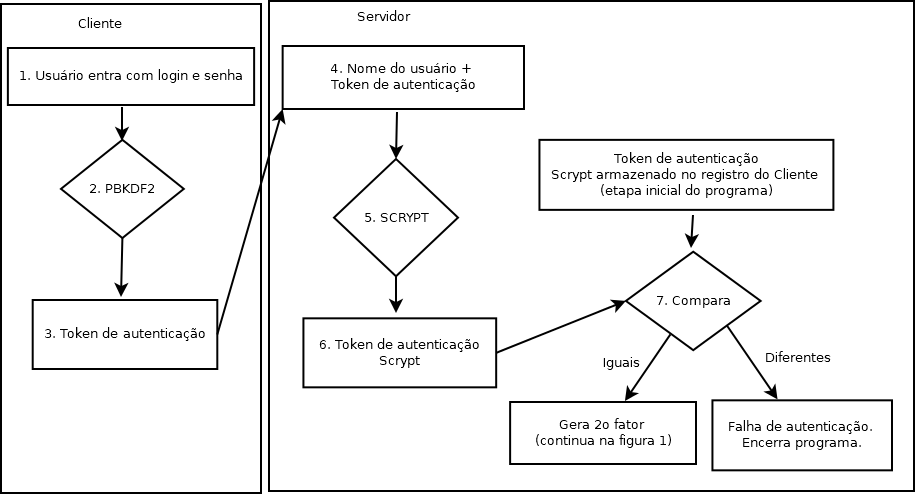
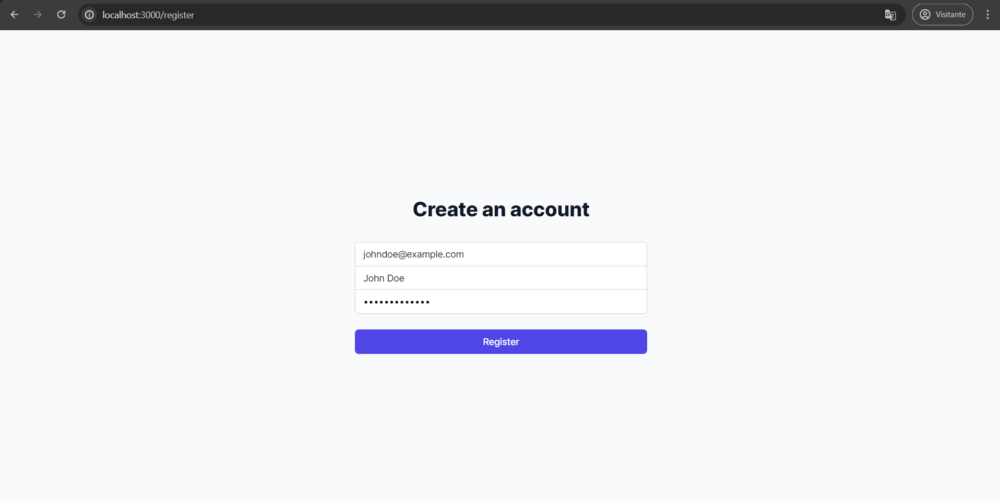
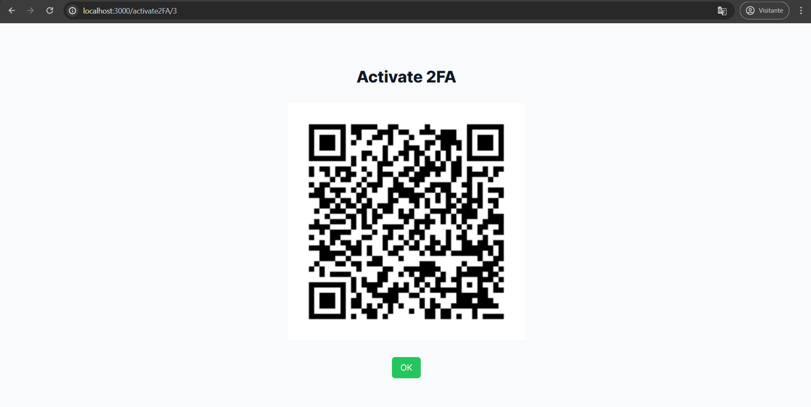
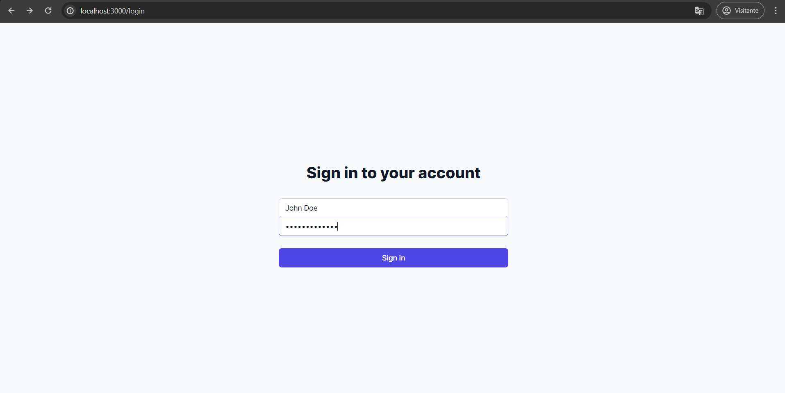
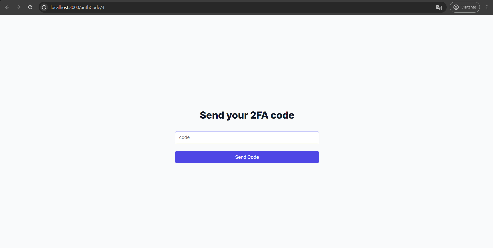
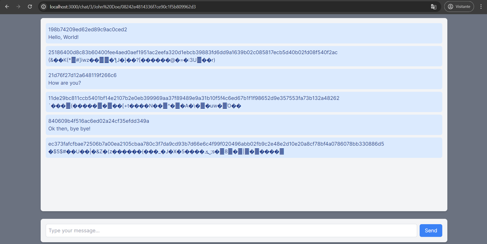

# 2FA Crypto Chat

## About

Work for the subject INE5680 - Information and Network Security at the Federal University of Santa Catarina: a chat between client and server with two-factor authentication (2FA), key derivation and symmetric encryption following the scheme in the image below.

## Running application

1. Install dependencies in the "backend" folder by running `npm install`;
2. Run the backend with `npm run start`;
3. Install dependencies in the "frontend" folder by running `npm install`;
4. Run the frontend with `npm next build` and then `npm next start`;
5. Access it: [http://localhost:3000/register](http://localhost:3000/register)

## Testing application

1. In [http://localhost:3000/register](http://localhost:3000/register), enter your user data;

2. In [http://localhost:3000/activate2FA](http://localhost:3000/activate2FA), use your preferred authentication app to activate your account's second factor;

3. In [http://localhost:3000/login](http://localhost:3000/login), simply sign in using your user data;

4. In [http://localhost:3000/authCode](http://localhost:3000/authCode), enter the code for the application showing in your preferred authentication app;

5. You did it! Now, in [http://localhost:3000/chat](http://localhost:3000/chat), exchange encrypted messages!

